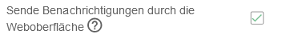
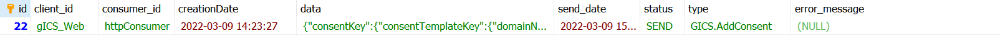

- Current Client Version: ths-notification-client version 2025.1.0 (Jun 2025)
- Current Service Version: ths-notification-service version 2025.1.0 (Jun 2025)

# Der THS-Notification-Service
_Author: [Unabhängige Treuhandstelle der Universitätsmedizin Greifswald](https://www.ths-greifswald.de)_

Der *THS-Notification-Service* ermöglicht es, Notifikationen über Ereignisse in verschiedenen Tools 
wie z.B. den THS-Tools **E-PIX**, **gPAS** und **gICS** an andere Systeme zu verteilen. 
Hierbei ist es prinzipiell egal, von welchem Tool diese empfangen und an welches andere Tool 
diese dann gesendet werden sollen. Der Service kann von außerhalb des Application-Servers 
(über eine **REST**-Schnittstelle) und innerhalb des Application-Servers (mit Hilfe des *EJB-Client* 
über **JNDI**) angesprochen werden.

## Die Architektur

Der *THS-Notification-Service* besteht aus zwei Komponenten, dem *Service* selbst 
(als **WAR** mit dem **REST-Endpoint**) und einem optionalen *EJB-Client* 
(als **EAR** mit dem **JNDI-Interface**).

#### Die Service-Komponente

Der *Service* (im **WAR**) ist die wichtigste Komponente. Er
- nimmt die Notifikationen per **REST-Endpoint** entgegen,
- prüft, ob *Consumer* für den verwendeten Message-Typ und den Client definiert sind,
- legt die Notifikationen für jeden *Consumer* in einer Datenbank ab,
- liest asynchron neue Notifikationen aus der Datenbank, leitet sie entsprechend der 
  *Consumer*-Konfiguration weiter und markiert sie mit `SEND` (und `send_date`) bzw. `ERROR`  und 
- unterstützt aktuell als *Consumer*-Endpoints **EJB** (per **JNDI**), **HTTP** und **MQTT**

#### Die EJB-Client-Komponente

Der *EJB-Client* (im **EAR**) ist prinzipiell optional. Da er die Notifikationen von Komponenten
innerhalb desselben Application-Servers per **JNDI** entgegennehmen kann, vereinfacht er so 
die Kommunikation aber wesentlich (der direkte Umgang mit **HTTP** und die Serialisierung der 
Notifikationen entfallen z.B.). Um den *THS-Notification-Service* mit **E-PIX**, **gPAS** oder **gICS** 
zu nutzen, wird der *EJB-Client* deshalb auf jeden Fall benötigt.

Im Application-Server wird der *EJB-Client* unter folgendem **JNDI**-Namen publiziert:

```
java:global/notification-client/notification-client-ejb/notification-client-default
```

Das Interface des *EJB-Client* ist denkbar einfach:

```
    void sendNotification(String messageType, org.codehaus.jettison.json.JSONObject message, String clientId) throws java.net.ConnectException;
    void init(String initString) throws java.net.ConnectException;
```
<div style="page-break-after: always;"></div>

## Die Benutzung des Service

#### Die Endpoints

Um den *Service* direkt anzusprechen (also nicht mithilfe des *EJB-Clients* über **JNDI**), 
können folgende **REST-Endpoints** genutzt werden:

**POST** `/ths-notification-service/rest/notification/{messageType}/{clientId}`

Die Platzhalter `{messageType}` und `{clientId}` müssen dabei entsprechend durch die 
von dem jeweiligen Tool verwendeten Namen ersetzt werden. Für den **E-PIX**, **gPAS** und den **gICS** 
wird das [weiter unten](#die-ths-tools-als-notification-producer) genauer beschrieben.
Im Request-Body wird eine Message im **JSON**-Format erwartet, die dann 1:1 an die *Consumer* 
weitergeleitet wird. Die *Consumer* ergeben sich aus der Konfiguration des *Service*.

#### Die Konfiguration

Die Konfiguration des *Service* erfolgt über eine **XML**-Beschreibung, die in der Datenbank des 
*THS-Notification-Service* hinterlegt wird. Die Datenbank heißt `notification_service`.
In dieser gibt es eine Tabelle `configuration` und darin einen Eintrag `notification.config`.
Dessen Feld `value` muss die **XML**-Beschreibung der Konfiguration enthalten. Diese hat folgenden 
grundlegenden Aufbau (hier für jeden *Consumer*-Typ mit je einem Beispiel):

```xml
<org.emau.icmvc.ttp.notification.service.model.config.NotificationConfig>
    <consumerConfigs>
        <param>
            <!-- Eine eindeutige ID des Consumers -->
            <key>Dispatcher</key>
            <value class="org.emau.icmvc.ttp.notification.service.model.config.ConsumerConfig">
                <!-- EJB, HTTP oder MQTT -->
                <connectionType>EJB</connectionType>
                <!-- Alle Message-Typen, die der Consumer erhalten soll (oder '*' als Platzhalter für alle) -->
                <messageTypes>
                    <string>EPIX.AssignIdentity</string>
                </messageTypes>
                <!-- Alle Client-IDs von denen keine Notifikationen empfangen werden sollen -->
                <excludeClientIdFilter class="set">
                    <string>gICS_Web</string>
                </excludeClientIdFilter>
                <!-- Type-Spezifische Parameter als Key-/Value-Paare, hier Beispiel EJB -->
                <parameter>
                    <param>
                        <key>ejb.jndi.url</key>
                        <value>java:global/test-dispatcher-ear-1.15.3/dispatcher-services-1.15.3/InternalNotificationConsumer</value>
                    </param>
                </parameter>
            </value>
        </param>
        <param>
            <key>HTTPConsumer</key>
            <value class="org.emau.icmvc.ttp.notification.service.model.config.ConsumerConfig">
                <connectionType>HTTP</connectionType>
                <messageTypes>
                    <string>GICS.AddConsent</string>
                    <string>GICS.SetQCForConsent</string>
                </messageTypes>
                <excludeClientIdFilter class="set">
                    <string>E-PIX_Web</string>
                </excludeClientIdFilter>
                <parameter>
                    <param>
                        <key>url</key>
                        <value>http(s)://httpbin.org/post</value>
                    </param>
                    <param>
                        <key>username</key>
                        <value>pp</value>
                    </param>
                    <param>
                        <key>password</key>
                        <value>pwd</value>
                    </param>
                </parameter>
            </value>
        </param>
        <param>
            <key>MQTTConsumer</key>
            <value class="org.emau.icmvc.ttp.notification.service.model.config.ConsumerConfig">
                <connectionType>MQTT</connectionType>
                <messageTypes>
                    <string>*</string>
                </messageTypes>
                <parameter>
                    <param>
                        <key>url</key>
                        <value>(tcp|ssl|tls)://localhost:1883</value>
                    </param>
                    <param>
                        <key>clientId</key>
                        <value>ttp-notiservice</value>
                    </param>
                    <param>
                        <key>qualityOfService</key>
                        <value>1</value>
                    </param>
                    <param>
                        <key>topicTemplate</key>
                        <!-- hier kann ein Topic mit Platzhaltern dynamisch zusammen gebaut werden -> type = Noti-Type, clientId = die Client-ID der Notification -->
                        <value>ttp/{clientId}/{type}</value>
                    </param>
                    <param>
                      <key>username</key>
                      <value>pp</value>
                    </param>
                    <param>
                      <key>password</key>
                      <value>pwd</value>
                    </param>
                </parameter>
            </value>
        </param>
    </consumerConfigs>
</org.emau.icmvc.ttp.notification.service.model.config.NotificationConfig>
```

*Hinweis 1: Die Registrierung von `messageTypes` in der XML-Konfiguration ist **case-sensitive**.*

*Hinweis 2: Falls ein **HTTP**-Consumer z.B. mit Basic-Authentication abgesichert ist, 
muss sich das in der Konfiguration für diesen Consumer entsprechend widerspiegeln, 
ansonsten kann man `username` und `password` auch einfach weglassen.*

<div style="page-break-after: always;"></div>

## Die THS-Tools als Notification-Producer 

Alle drei Tools, der **gICS**, der **gPAS** und der **E-PIX**  können Notifikationen senden. Hierfür werden im selben Container beide 
Deployments des *THS-Notification-Service* benötigt, der *EJB-Client* (im **EAR** `ths-notification-client-ear-1.1.1.ear`) 
und der *Service* (im **WAR** `ths-notification-service-1.1.0.war`). Die Tools senden bei der Benutzung bestimmter 
Interface-Methoden automatisch **JSON**-Nachrichten (über den *EJB-Client* per **JNDI**), wobei in der Regel die 
Namen der Methoden (zusammen mit dem Namen des Tools, z.B. `GICS.SetQcForConsent`) als Message-Typ (`messageType`) 
übergeben werden. Die Tools (*Producer*) haben selbst keinerlei Informationen über die möglichen *Consumer* der Notifikationen. 

Die *Consumer* der Notifikationen werden in der [XML-Konfiguration des THS-Notification-Service](#die-konfiguration) 
für bestimmte Message-Typen (oder für alle mit `*`) aktiviert. Dabei können mit dem `<excludeClientIdFilter>` 
auch einzelne Clients (*Producer*) per *Consumer*-Konfiguration ausgeschlossen werden. Nachdem der *EJB-Client* 
die Nachrichten an den *Service* übermittelt hat, verteilt dieser dann die jeweils passenden Nachrichten asynchron 
an die entsprechenden *Consumer*. 

Damit das Web-Interface der Tools automatisch Notifikationen sendet, muss das jeweilige Tool dafür konfiguriert werden. 
Damit eine **SOAP**-Interface-Methode eine Notifikation sendet, muss lediglich die entsprechende Variante der Methode
aus dem separaten Webservice-**Endpoint** mit einer nicht-leeren Client-ID verwendet werden.

#### gICS

Damit die Web-Oberfläche des **gICS** automatisch Notifikationen sendet, muss in seiner Domänenkonfiguration
`SEND_NOTIFICATIONS_WEB=true` enthalten sein. Für nicht-finalisierte Domänen kann man das auch über die 
Web-Oberfläche aktivieren. Die Client-ID der Web-Oberfläche des **gICS** ist `gICS_Web`.

Methoden im **gICS**, die Notifikationen (über den Client) an den *THS-Notification-Service* senden, sind im Webservice-Interface 
[`org.emau.icmvc.ganimed.ttp.cm2.GICSServiceWithNotification`](https://www.ths-greifswald.de/wp-content/uploads/tools/gics/doc/2023-2-0/org/emau/icmvc/ganimed/ttp/cm2/GICSServiceWithNotification.html)
definiert. Der zugehörige `<messageType>` ergibt sich aus folgender Tabelle:

| Methodenname         | Message-Typ               | Keys in JSON-Message                                                                          |
|----------------------|---------------------------|-----------------------------------------------------------------------------------------------|
| `setQCForConsent`    | `GICS.SetQcForConsent`    | `consentKey`, `previousPolicyStates`, `currentPolicyStates`, `type`, `clientId`, `context.qc` |
| `addConsent`         | `GICS.AddConsent`         | `consentKey`, `previousPolicyStates`, `currentPolicyStates`, `type`, `clientId`               |
| `refuseConsent`      | `GICS.RefuseConsent`      | `consentKey`, `previousPolicyStates`, `currentPolicyStates`, `type`, `clientId`               |
| `updateConsentInUse` | `GICS.UpdateConsentInUse` | `consentKey`, `previousPolicyStates`, `currentPolicyStates`, `type`, `clientId`               |

Die Message (im **JSON**-Format) selbst ist einheitlich aufgebaut für alle Notifikationen. 
Sie enthält 
- den Key des betroffenen **Consent**s (`consentKey`), 
- den Policy-State vor dem Request (`previousPolicyStates`),
- den Policy-State nach dem Request (`currentPolicyStates`), 
- eine optionale Kontext-Map (`context`), 
- sowie Metainformationen wie den Message-Typ (`type`), 
- die Client-ID (`clientId`) und 
- eventuell einen Kommentar (`comment`). 

Sie kann mithilfe von
[`org.emau.icmvc.ganimed.ttp.cm2.util.ConsentNotificationMessage`](https://www.ths-greifswald.de/wp-content/uploads/tools/gics/doc/2023-2-0/org/emau/icmvc/ganimed/ttp/cm2/util/ConsentNotificationMessage.html)
automatisch serialisiert und deserialisiert werden. Ein Beispiel für eine solche Message findet sich 
[hier](https://ths-greifswald.de/wp-content/uploads/tools/notification/gics-example-notification-message.json). 

Die Methoden des **gICS** mit Notifikationen sind über einen separaten **Endpoint** verfügbar:

[**GET** /gics/gicsServiceWithNotification?wsdl](http://localhost:8080/gics/gicsServiceWithNotification?wsdl)

<div style="page-break-after: always;"></div>

#### E-PIX

Damit die Web-Oberfläche des **E-PIX** automatisch Notifikationen sendet, muss in seiner Matching-Konfiguration
`useNotifications` aktiviert werden.  Die Client-ID der Web-Oberfläche des **E-PIX** ist `E-PIX_Web`.

Methoden im **E-PIX**, die Notifikationen (über den *EJB-Client*) an den *THS-Notification-Service* senden, sind im Webservice-Interface 
[`org.emau.icmvc.ttp.epix.service.EPIXServiceWithNotification`](https://www.ths-greifswald.de/wp-content/uploads/tools/e-pix/doc/2023-2-0/org/emau/icmvc/ttp/epix/service/EPIXServiceWithNotification.html)
definiert. Der zugehörige `<messageType>` ergibt sich aus folgender Tabelle:

| Methodenname                          | Message-Typ                                | Keys in JSON-Message                                                                                              |
|---------------------------------------|--------------------------------------------|-------------------------------------------------------------------------------------------------------------------|
| `addContact`                          | `EPIX.AddContact`                          | `Person.identityId`, `EPIX domain`                                                                                |
| `addLocalIdentifierToIdentifier`      | `EPIX.AddLocalIdentifierToIdentifier`      | `Local Identifier.Identifier`, `Local Identifier.Identifiers`, `EPIX domain`                                      |
| `addLocalIdentifierToMPI`             | `EPIX.AddIdentifierToPerson`               | `Person.mpiId`, `Person.identityId`, `EPIX domain`                                                                |
| `addPerson`                           | `EPIX.AddPerson`                           | `Person.mpiId`, `EPIX domain`, `comment`                                                                          |
| `assignIdentity`                      | `EPIX.AssignIdentity`                      | `Master Person.mpiId`, `Master Person.identityId`, `Slave Person.mpiId`, `Slave Person.identityId`, `EPIX domain` |
| `deactivateIdentity`                  | `EPIX.DeactivateIdentity`                  | `Person.identityId`, `EPIX domain`                                                                                |
| `deactivateContact`                   | `EPIX.DeactivateContact`                   | `Person.contactId`, `EPIX domain`                                                                                 |
| `deactivatePerson`                    | `EPIX.DeactivatePerson`                    | `Person.mpiId`, `EPIX domain`                                                                                     |
| `deleteContact`                       | `EPIX.DeleteContact`                       | `Person.contactId`, `EPIX domain`                                                                                 |
| `deleteIdentity`                      | `EPIX.DeleteIdentity`                      | `Person.identityId`, `EPIX domain`                                                                                |
| `deletePerson`                        | `EPIX.DeletePerson`                        | `Person.mpiId`, `EPIX domain`                                                                                     |
| `moveIdentitiesForIdentifierToPerson` | `EPIX.MoveIdentitiesForIdentifierToPerson` | `identifier`, `Target Person.mpiId`, `EPIX domain`, `comment`                                                     |
| `removeLocalIdentifier`               | `EPIX.RemoveIdentifier`                    | `localIds`, `EPIX domain`, `comment`                                                                              |
| `requestMPIBatch`                     | `EPIX.RequestMPI`                          | `Person.mpiId`, `EPIX domain`, `comment`                                                                          |
| `requestMPIWithConfig`                | `EPIX.RequestMPI`                          | `Person.mpiId`, `EPIX domain`, `comment`                                                                          |
| `requestMPI`                          | `EPIX.RequestMPI`                          | `Person.mpiId`, `EPIX domain`, `comment`                                                                          |
| `setReferenceIdentity`                | `EPIX.SetReferenceIdentity`                | `Person.mpiId`, `Person.identityId`, `EPIX domain`, `comment`                                                     |
| `updatePersonWithConfig`              | `EPIX.UpdatePerson`                        | `Person.mpiId`, `EPIX domain`, `comment`                                                                          |
| `updatePerson`                        | `EPIX.UpdatePerson`                        | `Person.mpiId`, `EPIX domain`, `comment`                                                                          |

Die Message (im **JSON**-Format) enthält immer 
- die betroffene **E-PIX**-Domäne (`EPIX domain`), 
- die IDs der beteiligten Personen oder Identitäten und 
- eventuell einen Kommentar (`comment`). 

Ein Beispiel für eine Message (zum Typ `EPIX.AssignIdentity`) findet sich 
[hier](https://ths-greifswald.de/wp-content/uploads/tools/notification/epix-example-notification-message.json).

Die Methoden des **E-PIX** mit Notifikationen sind nur über einen separaten **Endpoint** verfügbar:

[**GET** /epix/epixServiceWithNotification?wsdl](http://localhost:8080/epix/epixServiceWithNotification?wsdl)

#### gPAS

Damit die Web-Oberfläche des **gPAS** automatisch Notifikationen sendet, muss in den Properties für die jeweilige Domäne
`SEND_NOTIFICATIONS_WEB=true` enthalten sein. Für neue oder leere Domänen kann man Notifikationen auch über die Web-Oberfläche aktivieren.
Die Client-ID der Web-Oberfläche des **gPAS** ist `gPAS_Web`.

Methoden im **gPAS**, die Notifikationen (über den Client) an den *THS-Notification-Service* senden, sind im Webservice-Interface 
[`org.emau.icmvc.ganimed.ttp.psn.PSNManagerWithNotification`](https://www.ths-greifswald.de/wp-content/uploads/tools/gpas/doc/2023-2-0/org/emau/icmvc/ganimed/ttp/psn/PSNManagerWithNotification.html)
definiert. Der zugehörige `<messageType>` ergibt sich aus folgender Tabelle:

| Methodennamen                                            | Message-Typ                      | Keys in JSON-Message                                                |
|----------------------------------------------------------|----------------------------------|---------------------------------------------------------------------|
| `getOrCreatePseudonymFor`, `getOrCreatePseudonymForList` | `GPAS.GetOrCreatePseudonyms`     | `domain`, `request`, `pseudonymisationResult`, `type`, `clientId`   |
| `anonymiseEntry`, `anonymiseEntries`                     | `GPAS.AnonymiseEntries`          | `domain`, `request`, `anonymisationResult`, `type`, `clientId`      |
| `deleteEntry`, `deleteEntries`                           | `GPAS.DeleteEntries`             | `domain`, `request`, `deletionResult`, `type`, `clientId`           |
| `insertValuePseudonymPair`, `insertValuePseudonymPairs`  | `GPAS.InsertValuePseudonymPairs` | `domain`, `insertionRequest`, `insertionResult`, `type`, `clientId` |

Die Message (im **JSON**-Format) selbst ist einheitlich aufgebaut für alle Notifikationen. 
Sie enthält 
- den Namen der betroffenen Domäne (`domain`), 
- ein Set mit Values als Request (`request`) bzw.
- eine Map mit Value-Pseudonym-Paaren bei Einfügeoperationen (`insertionRequest`), 
- eine Map mit Value-Pseudonym-Paaren als Pseudonymisierungsergebnis (`pseudonymisationResult`), 
- eine Map mit Pseudonymen als Keys und Werten aus [AnonymisationResult](https://www.ths-greifswald.de/wp-content/uploads/tools/gpas/doc/2023-2-0/org/emau/icmvc/ganimed/ttp/psn/enums/AnonymisationResult.html) als Ergebnis von Anonymisierungen,
- eine Map mit Pseudonymen als Keys und Werten aus [DeletionResult](https://www.ths-greifswald.de/wp-content/uploads/tools/gpas/doc/2023-2-0/org/emau/icmvc/ganimed/ttp/psn/enums/DeletionResult.html) als Ergebnis von Löschungen oder
- eine Liste mit von [InsertPairExceptionDTO](https://www.ths-greifswald.de/wp-content/uploads/tools/gpas/doc/2023-2-0/org/emau/icmvc/ganimed/ttp/psn/dto/InsertPairExceptionDTO.html) als Ergebnis von Einfügungen,
- eine optionale Kontext-Map (`context`), sowie Metainformationen wie den Message-Typ (`type`), 
- die Client-ID (`clientId`) und 
- eventuell einen Kommentar (`comment`). 

Sie kann mithilfe von
[`org.emau.icmvc.ganimed.ttp.psn.utils.PSNNotificationMessage`](https://www.ths-greifswald.de/wp-content/uploads/tools/gpas/doc/2023-2-0/org/emau/icmvc/ganimed/ttp/psn/utils/PSNNotificationMessage.html)
automatisch serialisiert und deserialisiert werden. Beispiele für solche Messages finden sich 
[hier](https://ths-greifswald.de/wp-content/uploads/tools/notification/gpas-example-notification-message.json).

Die Methoden des **gPAS** mit Notifikationen sind über einen separaten **Endpoint** verfügbar:

[**GET** /gpas/gpasServiceWithNotification?wsdl](http://localhost:8080/gpas/gpasServiceWithNotification?wsdl)

-----

<div style="page-break-after: always;"></div>

# Use Cases

## Benachrichtigungen beim Anlegen einer neuen Einwilligung über die Web-Oberfläche des gICS versenden

### Hintergrund

Die Dateien für die Konfiguration und das Deployment des *THS-Notification-Service* werden seit **gICS** 2.14.0
mit ausgeliefert.

*Hinweis: [Notifications können sowohl per SOAP-Schnittstelle als auch per gICS-Web versandt werden](#gics).*

Beim Anlegen einer **neuen Einwilligung** über die gICS-Weboberfläche soll automatisch eine Notifikation 
an eine vordefinierte **URL** (hier: https://httpbin.org/post) per **HTTP-POST** versandt werden.

### Vorbereitung

#### (1) Anpassung der Domain-Konfiguration im **gICS**

In der Domänen-Konfiguration des **gICS** muss die Property zum Versand von Notifikationen gesetzt werden:



Alternativ ist das auch per Konfigurations-Import möglich:

```json
{
    "resourceType": "ExchangeFormatDefinition",
    "meta": {
        "profile": [
            "http://example.com/StructureDefinition/dontuse#ExchangeFormatDefinition"
        ]
    },
    "supportedVersion": "2.14.0",
    "domain": {
        [...]        
        "properties": "[...];SEND_NOTIFICATIONS_WEB = true;"
        [...]
    }
}
```

Für Bestandsprojekte ist auch eine direkte Manipulation der Domain-Properties in der Datenbank des **gICS** 
möglich. Dazu muss in der Tabelle `domain` im Feld der Spalte `PROPERTIES` der entsprechenden Domaine(n)
der Text `SEND_NOTIFICATIONS_WEB = true;` ergänzt werden. Danach ist ein Neustart des Servers notwendig.

<div style="page-break-after: always;"></div>

#### (2) Datenbank des **notification_service** konfigurieren

In `sqls/create_database_noti.sql` sind die Default-Passwörter enthalten und können dort ggf. angepasst werden.

In der Tabelle `configuration` des `notification_service` werden Konfigurationseinträge abgelegt.
Das Feld `value` für den Eintrag mit `notification.config` in der Spalte `configKey` muss (hier exemplarisch) 
wie folgt editiert werden:

```xml
<org.emau.icmvc.ttp.notification.service.model.config.NotificationConfig>
	<consumerConfigs>
		<param>
			<key>HTTPConsumer</key>
			<value class="org.emau.icmvc.ttp.notification.service.model.config.ConsumerConfig">
				<connectionType>HTTP</connectionType>
				<messageTypes>
					<string>GICS.AddConsent</string>
				</messageTypes>
				<parameter>
					<param>
						<key>url</key>
						<value>https://httpbin.org/post</value>
					</param>
				</parameter>
			</value>
		</param>
	</consumerConfigs>
</org.emau.icmvc.ttp.notification.service.model.config.NotificationConfig>

```

*Hinweis: Weiter oben findet man die
[Übersicht verfügbarer `ConnectionTypes`](#die-service-komponente) und die [Liste der verwendeter `MessageTypes`](#gics).*

Die Änderungen werden direkt übernommen. Es ist **kein Neustart des Systems erforderlich**.

### Funktionsfähigkeit testen

Legen Sie eine neue Einwilligung über die **gICS**-Web-Oberfläche an. Folgen Sie dabei bei Bedarf 
den Hinweisen im [Handbuch](http://ths-greifswald.de/gics/handbuch).

Öffnen Sie die Datenbank `notification_service` und lassen Sie sich die Einträge der Tabelle `notifications` anzeigen.

Bei Erfolg ist nun folgender Eintrag (hier beispielhaft) erkennbar.



Sollte der Versand nicht erfolgreich gewesen sein, kann der Eintrag wie folgt aussehen. Details entnehmen Sie dem Server-Log.


<div style="page-break-after: always;"></div>

# Additional Information #
## Credits ##
**Concept and implementation:** P. Penndorf <br/>
**Web-Client:** A. Blumentritt <br/>
**Docker:** R. Schuldt <br/>
**Documentation and Test:** F.M.Moser, P.Penndorf, M.Bialke

## License ##
**License:** AGPLv3, https://www.gnu.org/licenses/agpl-3.0.en.html <br/>
**Copyright:** 2014 - 2025 University Medicine Greifswald <br/>
**Contact:** https://www.ths-greifswald.de/kontakt/
